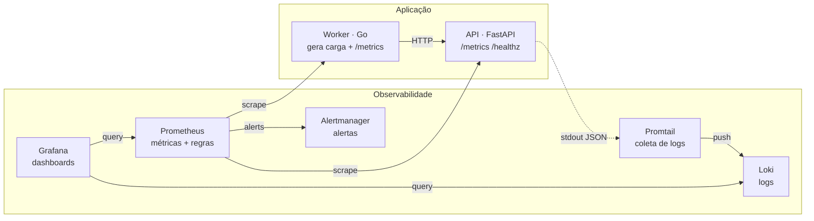

<h1 align="center">🔭 Observability &amp; DevOps Lab</h1>

<p align="center">
  <b>Stack completa de observabilidade que sobe com um único comando — 100% local, zero dependência externa.</b><br>
  <sub>Métricas · Logs · Alertas · Dashboards · Infrastructure as Code · CI/CD</sub>
</p>

<p align="center">
  
  
  
  
  
  
  
  
</p>

---

## 📖 Sobre

Um laboratório de observabilidade e DevOps pensado para ser **executado de ponta a ponta na sua máquina**, sem conta em nuvem, sem API key, sem custo. Sobe uma aplicação instrumentada + um worker que gera carga + toda a stack de observabilidade (Prometheus, Grafana, Loki, Promtail, Alertmanager) com um `make up`.

O objetivo é demonstrar, na prática, **como uma aplicação é observada e operada em produção**: coleta de métricas (RED), agregação de logs, alertas baseados em SLO, dashboards provisionados como código e a infraestrutura descrita declarativamente.

> **Por que existe:** servir de referência prática de engenharia de plataforma / SRE — do código instrumentado ao dashboard, passando por IaC e CI/CD.

## 🏗️ Arquitetura



## 🚀 Quick start

**Pré-requisito:** Docker + Docker Compose.

```bash
git clone https://github.com/theeedu/observability-lab.git
cd observability-lab

make up        # sobe toda a stack (build + start)
make health    # confirma que tudo está saudável
```

Pronto. A stack já começa a se popular sozinha (o worker gera tráfego contínuo). Para um pico manual de carga:

```bash
make load                 # carga padrão
./scripts/loadtest.sh 500 20   # 500 requisições, 20 em paralelo
```

Encerrar:

```bash
make down      # para a stack (mantém dados)
make clean     # para e remove volumes
```

## 🌐 Serviços e portas

| Serviço | URL | Credenciais |
|---------|-----|-------------|
| **Grafana** (dashboards) | http://localhost:3000 | `admin` / `admin` |
| **API** (docs Swagger) | http://localhost:8000/docs | — |
| **API** (métricas) | http://localhost:8000/metrics | — |
| **Prometheus** | http://localhost:9091 | — |
| **Alertmanager** | http://localhost:9093 | — |
| **Loki** | http://localhost:3100 | — |

Abra o Grafana → dashboard **"Observability Lab — RED Metrics"** (já provisionado) para ver taxa de requisições, erros, latência (p50/p95/p99) e logs em tempo real.

## 🧩 O que este projeto demonstra

- **Instrumentação de aplicação** — métricas no padrão **RED** (Rate, Errors, Duration) e logs estruturados em JSON.
- **Coleta e armazenamento** — Prometheus (métricas) e Loki (logs) via Promtail.
- **Alertas baseados em SLO** — regras PromQL para taxa de erro, latência p95 e disponibilidade de targets.
- **Dashboards como código** — Grafana com datasources e dashboards **provisionados** (nada configurado na mão).
- **Infrastructure as Code** — Terraform modelando rede e volumes (provider Docker).
- **Automação de operação** — `Makefile` e scripts Bash idempotentes (`make up`, `make health`, `make load`).
- **CI/CD** — GitHub Actions com testes (Python + Go), lint, `terraform validate` e build das imagens.
- **Boas práticas de container** — imagens multi-stage, usuários non-root, healthchecks.
- **Poliglota com propósito** — Python (API), Go (worker), HCL (IaC), Bash (automação), YAML (configs), PromQL (alertas).

## 📚 Documentação

- [`docs/ARCHITECTURE.md`](docs/ARCHITECTURE.md) — decisões de arquitetura e fluxo de dados
- [`docs/SLO.md`](docs/SLO.md) — SLIs, SLOs e como os alertas se relacionam a eles
- [`docs/RUNBOOK.md`](docs/RUNBOOK.md) — runbook de operação e troubleshooting

## 📂 Estrutura

```
observability-lab/
├── docker-compose.yml          # Orquestra toda a stack
├── Makefile                    # Automação de operação (make help)
├── services/
│   ├── api/                    # API instrumentada (FastAPI, Python)
│   └── worker/                 # Worker gerador de carga (Go)
├── stack/
│   ├── prometheus/             # Config + regras de alerta (PromQL)
│   ├── alertmanager/           # Roteamento de alertas
│   ├── loki/                   # Config de logs
│   ├── promtail/               # Coleta de logs dos containers
│   └── grafana/                # Datasources + dashboards provisionados
├── infra/                      # Infraestrutura como código (Terraform)
├── scripts/                    # healthcheck.sh, loadtest.sh
├── .github/workflows/          # Pipeline de CI
└── docs/                       # Arquitetura, SLO, runbook
```

## 🧪 Desenvolvimento e testes

```bash
make test          # testes de API (pytest) + worker (go test)
make tf-validate   # valida a configuração Terraform
make lint          # shellcheck nos scripts
make help          # lista todos os alvos disponíveis
```

---

<p align="center">
  <sub>Desenvolvido por <a href="https://github.com/theeedu">Carlos Lima</a> · Licença MIT</sub>
</p>
